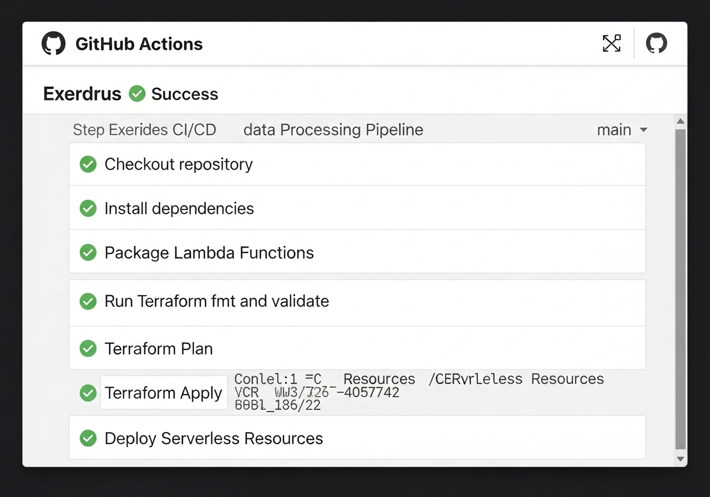
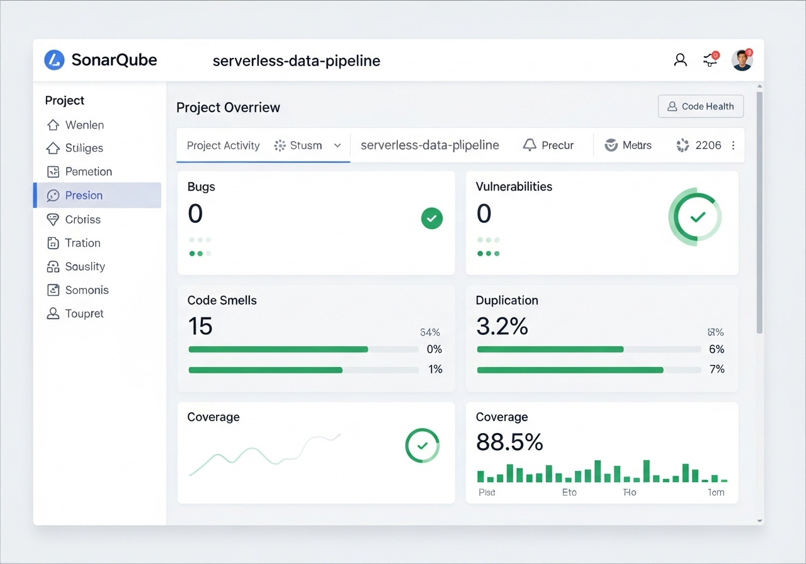
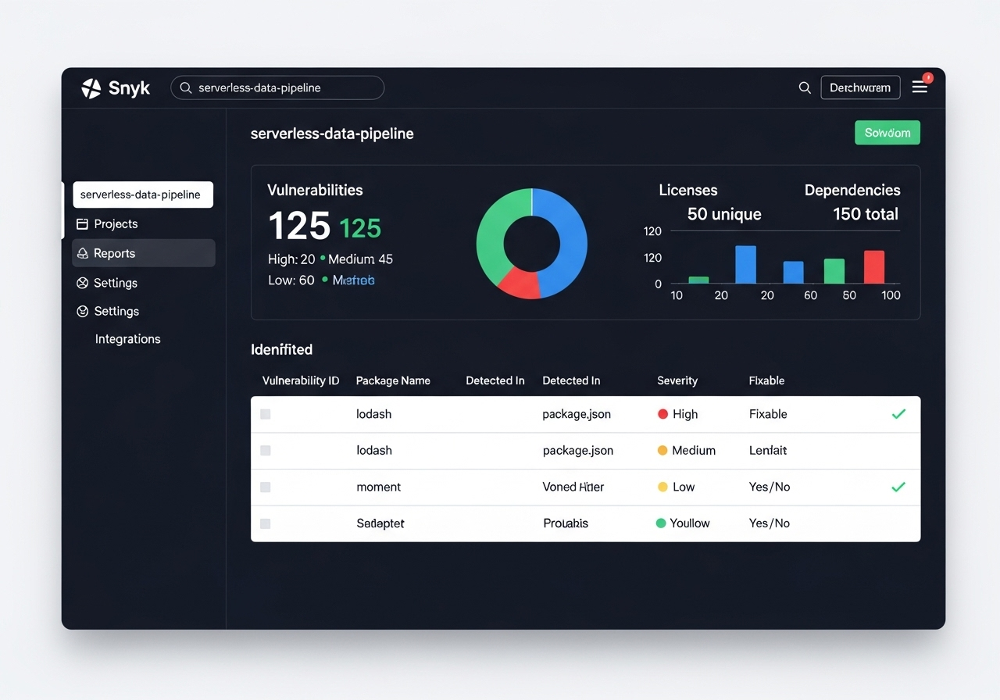
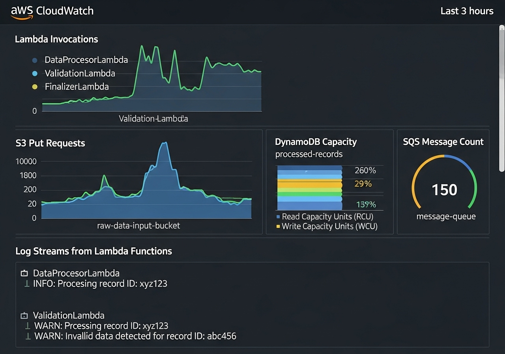
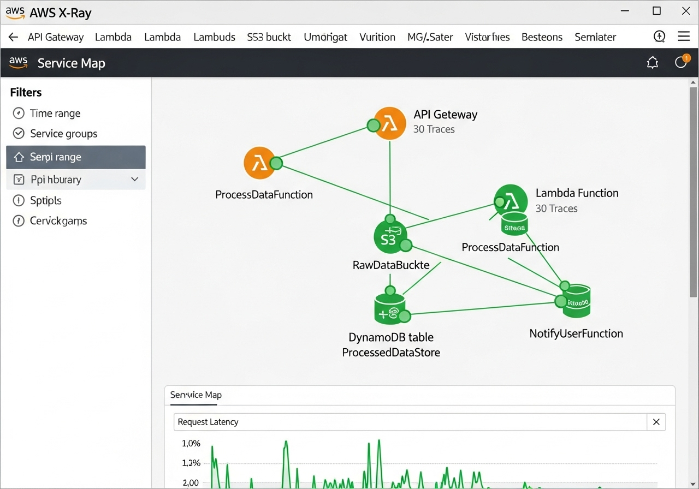

# Serverless Data Processing Pipeline

An event-driven data pipeline on AWS: a file lands in S3, triggers a Lambda function, which parses it and writes to DynamoDB, pushes a message to SQS, and is fully traceable end-to-end via X-Ray. All infrastructure — Lambda, S3, DynamoDB, Kinesis, SQS, API Gateway — is provisioned with Terraform, with GitHub Actions handling packaging and deployment.

## How it works


1. A file uploaded to the S3 input bucket triggers the Lambda handler (`app/main.py`)
2. The handler reads the object, writes the parsed content to DynamoDB, and forwards a message to SQS for downstream consumers
3. API Gateway exposes a second entry point for pushing data directly into the pipeline instead of via S3
4. Kinesis is available for streaming ingestion where a queue isn't the right fit
5. CloudWatch and X-Ray cover logging, metrics, and distributed tracing across every hop

## Why serverless

No servers to patch or scale manually — Lambda scales with the number of incoming files/events, and the whole stack (compute, storage, queueing) is pay-per-use. Terraform makes the entire pipeline reproducible from a clean AWS account.

## CI/CD and security

- **GitHub Actions** packages and deploys the Lambda on every push
  
- **Sonarqube** for static code analysis
  
- **Snyk** for dependency vulnerability scanning
  
- **Trivy** for filesystem/container image scanning

## Running it

```bash
git clone https://github.com/anasarb1/serverless-data-pipeline.git
cd serverless-data-pipeline/terraform
terraform init
terraform plan
terraform apply --auto-approve
```

Terraform provisions the S3 bucket, Lambda function, DynamoDB table, SQS queue, Kinesis stream, and API Gateway. To test it:

- **S3 trigger:** upload a file to the input bucket and watch it land in DynamoDB
- **API Gateway:** `curl` or Postman against the exposed endpoint

## Observability




CloudWatch covers logs/metrics for every component; X-Ray traces a request end-to-end through Lambda, DynamoDB, and SQS to spot bottlenecks.

## Tech stack

AWS Lambda, S3, DynamoDB, Kinesis, SQS, API Gateway, Terraform, GitHub Actions, CloudWatch, X-Ray

## License

MIT
