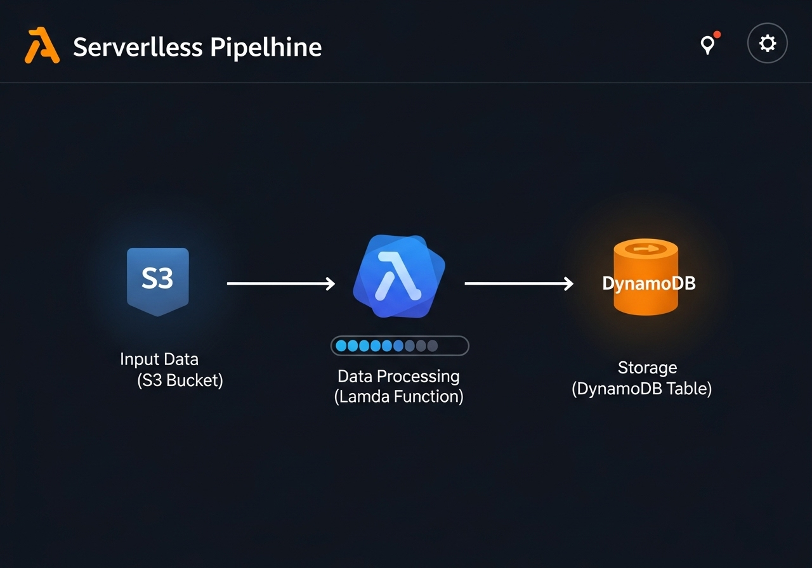

# Serverless Data Processing Pipeline

## Project Summary

As part of my End-to-End DevOps Project, I undertook the task of deploying a fully serverless data processing pipeline on Amazon Web Services (AWS). This project aimed to demonstrate proficiency in building efficient, scalable, and cost-effective solutions for handling large volumes of data using event-driven architectures and Infrastructure as Code.

## Task

To accomplish this, I identified the need for a comprehensive set of tools and technologies to ensure the efficiency, scalability, and cost-effectiveness of the data processing pipeline. My task involved selecting and integrating various serverless tools into the project workflow to address key areas such as data ingestion, processing, storage, and analysis, while implementing continuous integration and deployment practices.

## Architecture:


## Tools:

### Cloud Infrastructure Setup:

- **AWS Lambda:** (Serverless compute for data processing)
- **Amazon S3:** (Scalable object storage for data ingestion and storage)
- **Amazon DynamoDB:** (NoSQL database for processed data storage)
- **Amazon Kinesis:** (Real-time data streaming for analytics)
- **Amazon SQS:** (Message queuing for decoupling components)
- **Amazon API Gateway:** (Secure entry point for data ingestion)
- **Terraform:** (Infrastructure As Code)

### Continuous Integration & Continuous Deployment:

- **GitHub Actions:** (CI/CD pipeline/workflow)


### Security (SAST/SCA) Scanning:

- **Sonarqube:** (Code quality analysis through SAST Scanning)

- **Snyk:** (Vulnerability scanning and dependency management analysis)

- **Trivy:** (Filesystem and Container image vulnerability scanning)

### Monitoring & Logging:

- **AWS CloudWatch:** (Monitoring and logging for serverless components)

- **AWS X-Ray:** (Distributed tracing for serverless applications)


## Working Application:



## Results:

Through my effective selection and integration of these tools and technologies, my Serverless Data Processing Pipeline successfully achieved its objectives of building an efficient, scalable, and cost-effective solution for data handling. My implementation of industry best practices through event-driven architectures, CI/CD automation, security scanning, and comprehensive monitoring capabilities laid the foundation for reliable and efficient serverless data processing.

## Setup Guide

### Prerequisites

Before you begin, ensure you have the following installed and configured:

- AWS CLI configured with appropriate credentials.
- Terraform (v1.0.0+)
- Git

### Deployment Steps

1.  **Clone the Repository:**

    ```bash
    git clone https://github.com/anasarb1/serverless-data-pipeline.git
    cd serverless-data-pipeline
    ```

2.  **Configure AWS Credentials:**

    Ensure your AWS CLI is configured with an IAM user that has programmatic access and sufficient permissions to create and manage S3 buckets, Lambda functions, DynamoDB tables, SQS queues, Kinesis streams, and API Gateway resources.

3.  **Initialize Terraform:**

    Navigate to the `terraform` directory and initialize Terraform:

    ```bash
    cd terraform
    terraform init
    ```

4.  **Plan and Apply Terraform:**

    Review the execution plan and apply the infrastructure changes:

    ```bash
    terraform plan
    terraform apply --auto-approve
    ```

    This will provision all the necessary AWS serverless resources.

5.  **Deploy Lambda Functions:**

    The CI/CD pipeline (GitHub Actions) will handle the packaging and deployment of the AWS Lambda functions defined in the `app` directory.

6.  **Test the Pipeline:**

    - **S3 Trigger:** Upload a sample file to the configured S3 input bucket to trigger the data processing Lambda function.
    - **API Gateway:** Use `curl` or a tool like Postman to send data to the API Gateway endpoint and observe the pipeline\"s behavior.

## Monitoring and Logging

- **AWS CloudWatch:** Access logs and metrics for all serverless components (Lambda, API Gateway, DynamoDB, SQS, Kinesis) directly from the AWS Management Console.
- **AWS X-Ray:** Utilize X-Ray for end-to-end tracing of requests through the serverless pipeline, helping to identify performance bottlenecks and errors.

## Contributing

Contributions are welcome! Please fork the repository and submit pull requests.

## License

This project is licensed under the MIT License.


