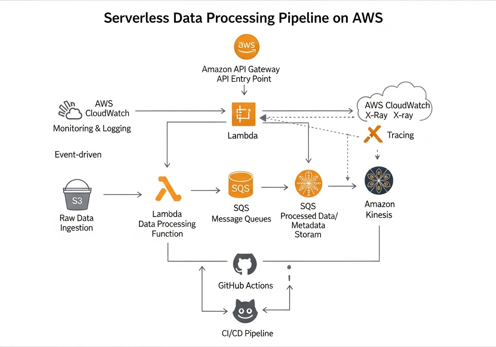

# Serverless Data Processing Pipeline

## Project Description

This project demonstrates a fully serverless data processing pipeline on Amazon Web Services (AWS), designed for efficient, scalable, and cost-effective handling of large volumes of data. It showcases proficiency in event-driven architectures, Infrastructure as Code (IaC) with Terraform, and continuous integration and deployment (CI/CD) with GitHub Actions. The pipeline integrates various AWS serverless services to ingest, process, store, and analyze data, highlighting best practices for cloud cost optimization and operational efficiency.

## Architecture Overview



The pipeline begins with data ingestion into an Amazon S3 bucket, which triggers AWS Lambda functions for processing and transformation. Processed data can be stored in Amazon DynamoDB for quick access or further processed through Amazon Kinesis for real-time analytics. Amazon SQS is utilized for decoupling components and ensuring reliable message delivery. Amazon API Gateway provides a secure and scalable entry point for data ingestion or querying. All infrastructure is provisioned and managed using Terraform, and deployments are automated via GitHub Actions. AWS CloudWatch and X-Ray provide comprehensive monitoring, logging, and tracing capabilities for the entire serverless ecosystem.

## Features

- **Event-Driven Architecture:** Data processing is triggered automatically by events (e.g., new file uploads to S3), ensuring real-time responsiveness and efficient resource utilization.
- **Fully Serverless:** Leverages AWS Lambda, S3, DynamoDB, SQS, Kinesis, and API Gateway to eliminate server management overhead and optimize costs based on actual usage.
- **Automated Infrastructure Provisioning:** Terraform scripts define and deploy all AWS resources, ensuring consistency, repeatability, and version control of the infrastructure.
- **Continuous Deployment:** GitHub Actions automate the deployment of Lambda functions and infrastructure changes, enabling rapid and reliable updates to the pipeline.
- **Scalable and Resilient:** Designed to automatically scale with data volume fluctuations and built with redundancy to ensure high availability and fault tolerance.
- **Comprehensive Observability:** Integrated AWS CloudWatch for logging and metrics, and AWS X-Ray for distributed tracing, providing deep insights into pipeline performance and bottlenecks.

## Setup Guide

### Prerequisites

Before you begin, ensure you have the following installed and configured:

- AWS CLI configured with appropriate credentials.
- Terraform (v1.0.0+)
- Git

### Deployment Steps

1.  **Clone the Repository:**

    ```bash
    git clone https://github.com/your-username/serverless-data-pipeline.git
    cd serverless-data-pipeline
    ```

2.  **Configure AWS Credentials:**

    Ensure your AWS CLI is configured with an IAM user that has programmatic access and sufficient permissions to create and manage S3 buckets, Lambda functions, DynamoDB tables, SQS queues, Kinesis streams, and API Gateway resources.

3.  **Initialize Terraform:**

    Navigate to the `terraform` directory and initialize Terraform:

    ```bash
    cd terraform
    terraform init
    ```

4.  **Plan and Apply Terraform:**

    Review the execution plan and apply the infrastructure changes:

    ```bash
    terraform plan
    terraform apply --auto-approve
    ```

    This will provision all the necessary AWS serverless resources.

5.  **Deploy Lambda Functions:**

    The CI/CD pipeline (GitHub Actions) will handle the packaging and deployment of the AWS Lambda functions defined in the `app` directory.

6.  **Test the Pipeline:**

    - **S3 Trigger:** Upload a sample file to the configured S3 input bucket to trigger the data processing Lambda function.
    - **API Gateway:** Use `curl` or a tool like Postman to send data to the API Gateway endpoint and observe the pipeline's behavior.

## Monitoring and Logging

- **AWS CloudWatch:** Access logs and metrics for all serverless components (Lambda, API Gateway, DynamoDB, SQS, Kinesis) directly from the AWS Management Console.
- **AWS X-Ray:** Utilize X-Ray for end-to-end tracing of requests through the serverless pipeline, helping to identify performance bottlenecks and errors.

## Contributing

Contributions are welcome! Please fork the repository and submit pull requests.

## License

This project is licensed under the MIT License.


## Impact and Achievements

This serverless data processing pipeline significantly enhances data handling capabilities, demonstrating expertise in building highly scalable, cost-effective, and resilient cloud solutions. Key achievements include:

- **Automated Data Ingestion and Processing:** Implemented an event-driven architecture that automatically triggers data processing upon ingestion, reducing manual intervention and accelerating data availability for analysis.
- **Significant Cost Savings:** Leveraged a fully serverless design, eliminating the need for provisioning and managing servers, resulting in substantial cost reductions by paying only for compute resources consumed during data processing.
- **Massive Scalability:** Designed the pipeline to automatically scale to handle fluctuating data volumes, ensuring consistent performance and reliability even during peak loads without manual intervention.
- **Real-time Data Capabilities:** Integrated Amazon Kinesis for real-time data streaming and processing, enabling immediate insights and rapid response to incoming data.
- **Enhanced Observability:** Utilized AWS CloudWatch for comprehensive logging and metrics, and AWS X-Ray for end-to-end tracing of data flow, providing deep visibility into pipeline performance and facilitating rapid debugging.


